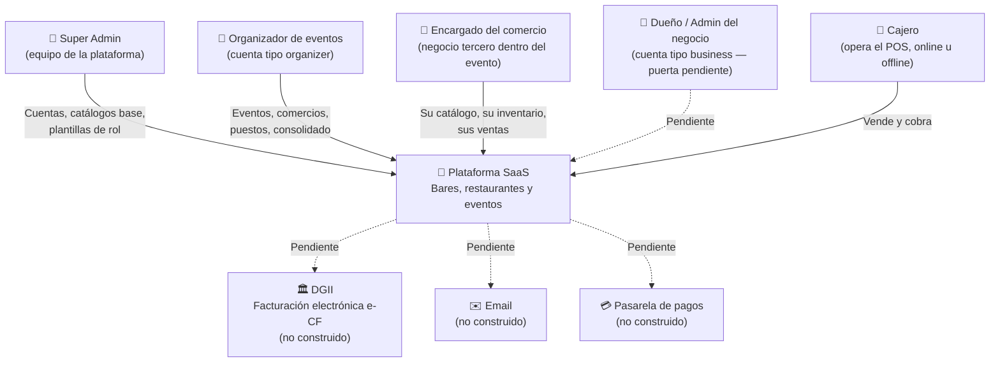
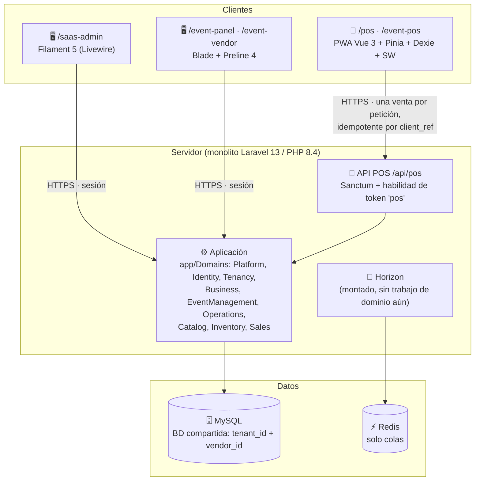
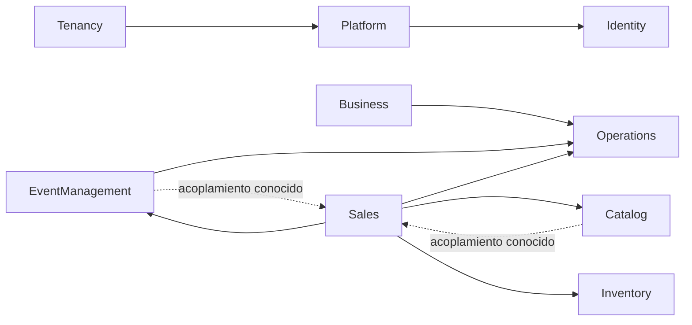

# 02 — Arquitectura del Sistema

> **v0.2 — 2026-08-05.** La v0.1 (25 de julio) describía un sistema que aún no
> existía. Este documento describe el que existe. Lo que sigue siendo plan —
> fiscal DGII, reportería consolidada, el mundo negocio — está al final, en su
> propia sección, para que nadie lo confunda con lo construido.

## Nivel 1 — Diagrama de contexto (C4)

Dos mundos, elegidos al dar de alta la cuenta y **inmutables** (`TenantType`):

- **Organizador** — productoras de festivales. Opera con eventos, y dentro de
  cada evento con comercios terceros y sus puestos.
- **Negocio** — bar, restaurante o discoteca permanente. Opera con sucursales.

Un evento nunca comparte datos con un negocio. Si un negocio cliente quiere una
barra en un festival, esa barra se crea dentro del evento del organizador.

## Nivel 2 — Diagrama de contenedores (C4)

Sesión y cache van a **base de datos** (`SESSION_DRIVER=database`,
`CACHE_STORE=database`); Redis hoy solo sostiene las colas. No hay S3 ni ningún
almacenamiento de archivos: nada del sistema sube archivos todavía.

## Las puertas: una por audiencia y por modalidad

La decisión estructural más importante del proyecto después del multi-tenancy
(ADR-006 y ADR-007). Cada audiencia entra por su propia URL, con su propio
guard fail-closed. Nada de un panel único que se adapte con condicionales: las
reglas de los mundos no viven en código compartido.

| Puerta | Audiencia | Stack | Estado |
|---|---|---|---|
| `/saas-admin` | Superadmin de la plataforma | Filament 5 | Vigente |
| `/event-panel` | Organizador del evento | Blade + Preline | Vigente |
| `/event-vendor` | Personal del comercio del evento | Blade + Preline | Vigente |
| `/event-pos` | Cajero de un puesto de evento | PWA Vue | Vigente |
| `/pos` | Cajero de una sucursal | PWA Vue | Vigente |
| `/business` | Bar/restaurante independiente | Blade + Preline | **Pendiente** |
| `/app` | Filament de cuentas | Filament 5 | **En apagado** (se apaga al alcanzar paridad `/event-vendor`) |

Reglas que hay que conocer antes de tocar nada de esto:

- **`/event-vendor` es singular a propósito.** Un usuario pertenece a UN
  comercio; su comercio es implícito por su usuario, **jamás elegido por URL**.
- **Los dos POS comparten motor.** Cada puerta tiene su URL, su manifiesto y su
  identidad instalable, y el login rechaza al cajero del mundo equivocado con un
  mensaje que le dice a dónde ir. Pero el código offline —outbox, sincronización
  idempotente, arqueos— es UNO. Si algún día las modalidades divergen de verdad
  en la caja, el punto de corte es el componente de pantalla, no el motor.
- **Las operaciones no se duplican.** Los formularios de catálogo e inventario
  viven una sola vez (`HandlesVendorCatalog`, `HandlesVendorInventory`) y las
  vistas son parciales parametrizados por URL (`resources/views/vendors/tabs/*`):
  el organizador llega por `/event-panel/comercios/{id}`, el encargado por su
  comercio implícito, y ambos renderizan lo mismo.

### La entrada

`/` no es un panel: es un desvío. Con sesión manda a la puerta de cada quien;
sin ella, a `/entrar` (`/login` queda como atajo humano que redirige).

Una sola pieza decide el destino — `Identity\Queries\HomeForUser` — para que el
login, los rebotes y los enlaces no puedan contradecirse. Y decide **por
capacidades, no por nombre de rol**:

1. Staff de plataforma → `/saas-admin`.
2. Usuario que no pertenece a un comercio → `/event-panel`.
3. Usuario de comercio con algún permiso de gestión → `/event-vendor`.
4. El resto, si puede operar la caja → `/pos`.

Los rebotes los ejecutan tres middlewares: `EnsureEventVendorUser` (puerta del
comercio, entrada positiva por capacidades), `RedirectVendorStaffToEventVendor`
(saca al personal de comercio del dashboard de `/app`) y `EnsurePosCapability`
(la puerta de **cada** petición del POS, no solo del login).

## Módulos del monolito

Decidido y ejecutado: **`app/Domains/`**, sin `nwidart/laravel-modules`.

| Módulo | Responsabilidad hoy |
|---|---|
| **Platform** | Tenant y sus dos tipos, catálogos base del superadmin (FoodType, VendorType), validación de RNC |
| **Identity** | Usuarios, permisos (enum fijo), roles como plantillas en BD, `HomeForUser`, guard del último dueño |
| **Tenancy** | `TenantContext`, `ContextResolver`, `TenantScope`, trait `BelongsToTenant`, middleware de contexto |
| **Business** | `BusinessAccount` y sus sucursales (`Branch`) |
| **EventManagement** | Eventos, comercios (`Vendor`), invitación al evento con comisión, puestos (`EventOutlet`), `VendorScope`/`VendorContext` |
| **Operations** | `OperatingUnit`: la unidad donde se vende, sea sucursal o puesto de evento |
| **Catalog** | Categorías, productos (con `itbis_exempt`), recetas (escandallo) |
| **Inventory** | Insumos, existencias por unidad, compras, traslados, mermas, `StockLedger` |
| **Sales** | Cajas, órdenes, líneas, cobros, reembolsos, numeración, modalidad de ITBIS |

**Fiscal**, **Reporting** y **Sync** no existen. El endpoint del POS son
controladores (`app/Http/Controllers/Pos/`) sobre las acciones de Sales, y la
reportería que hay vive en los controladores del panel y en `Sales\Queries`.

### La forma del código

No hay clases «Service» (la única de todo el repo es `Inventory\Services\StockLedger`).
El patrón es **acción invocable**: una clase, un `__invoke`, una decisión de
negocio. `PlaceOrder`, `PayOrder`, `VoidOrder`, `RefundOrder`, `OpenCashSession`,
`CloseCashSession`, `NextOrderNumber`, `RegisterPurchase`, `CreateTenant`…

Alrededor de ellas: `Models/`, `Enums/` (con etiquetas y descripciones en
español, que son las que ve el usuario), `Queries/` (lecturas con nombre) y
`Eloquent/` (builders propios). Los controladores autorizan, delegan y
presentan. **Prohibido meter reglas de negocio en un controlador.**

## Reglas de dependencia entre módulos

- **Sales depende de EventManagement**, no al revés: `PlaceOrder` consulta
  `EventVendor` para congelar la comisión pactada, y `CloseCashSession` compara
  la caja contra el `VendorContext`.
- **Dos acoplamientos inversos conocidos**, que preferimos escritos a
  escondidos: `Catalog\Models\Product` importa `Sales\Models\OrderLine` para su
  relación `orderLines()`, y `EventManagement\Models\Vendor` importa
  `Sales\Enums\ItbisMode` para su columna `itbis_mode`. Ninguno de los dos es
  lógica de venta dentro de catálogo — son una relación y un cast — pero rompen
  la regla «una sola dirección» de la v0.1 y hay que decidirlos, no heredarlos.

## Aislamiento: dos ejes, fail-closed

Base de datos compartida. El aislamiento es del código, y por eso es explícito y
se verifica con tests de arquitectura.

**Eje 1 — cuenta (`tenant_id`).** `TenantScope` acota cada lectura; sin contexto
activo la consulta hace `where 1=0` — un middleware olvidado no filtra datos de
otra cuenta, deja de devolver datos. Las escrituras son igual de estrictas:
`BelongsToTenant` rellena el `tenant_id` del contexto y lanza
`CrossTenantWriteException` si alguien intenta crear o mover una fila hacia otra
cuenta. `insert()` y `upsert()` escapan de Eloquent, así que se bloquean en el
query builder (`TenantScopedBuilder`, `UnsafeBulkWriteException`). Cruzar cuentas
solo es posible de forma explícita: `TenantContext::runAs()`.

**Eje 2 — comercio (`vendor_id`).** Dentro de una cuenta de organizador, cada
comercio tercero es un negocio ajeno a los demás: `VendorScope` y `VendorContext`
hacen que lo de otro comercio simplemente no exista.

**Una sola pieza resuelve el contexto** — `Tenancy\ContextResolver` — y la
consumen el middleware web, el de la API y el helper de tests, para que no puedan
divergir. Empieza siempre limpiando: fuera de Octane el contenedor puede
conservar el contexto de una petición anterior, y heredarlo sería operar como
otra cuenta.

**Trampa de Filament que hay que conocer:** las páginas reautorizan en cada
hidratación de Livewire (buscar, paginar, abrir un modal) y esas peticiones no
pasan por el stack del panel. Por eso `SetTenantContext` está en el grupo `web`
**y** en el `authMiddleware(..., isPersistent: true)` del panel. Sin las dos,
esas peticiones responden 403 aunque la pantalla se hubiera abierto bien.

**Lo sostienen tests de arquitectura**, no la disciplina: `tests/TenantIsolation/`
falla si un modelo de negocio nace sin `BelongsToTenant` o si una tabla de
negocio nace sin `tenant_id NOT NULL` y sus índices únicos compuestos.

## Ventas: lo que se cobra, se congela

El dominio construido después de la v0.1, y el que más invariantes tiene.

- **La venta es historia.** Cobrada o anulada, la orden no se edita: el guard de
  `updating`/`deleting` lo impide. Corregir es un hecho nuevo (un reembolso),
  nunca un update del pasado. `Payment` y `Refund` nacen y ya no cambian.
- **Idempotencia real.** `PlaceOrder` es idempotente por `client_ref` dentro de
  su unidad operativa: el POS offline puede reenviar mil veces y existe una sola
  orden, un solo cobro, un solo descuento de stock. Y **verifica** el reenvío: si
  llega la misma referencia con otra sesión, otras líneas u otra propina, es un
  error operable, no un éxito silencioso sobre una venta distinta.
- **Número legible, serie por comercio.** `P0041`: la letra viene del canal
  (`SalesChannel`) y **etiqueta, no numera** — la serie es una sola por comercio
  (por cuenta si no hay comercio), así que «el 41» identifica una única venta.
  El contador se toma dentro de la transacción de la venta, de modo que un
  rollback devuelve el número y la serie no deja huecos: importa para una
  numeración que un día será fiscal.
- **ITBIS por producto y por modalidad.** El producto declara si está exento
  (`itbis_exempt`); el **negocio** declara la modalidad (`ItbisMode`): incluido
  en el precio (desglose ×18/118 hacia adentro, el total no crece) o por fuera
  (se suma al cobrar). La regla se resuelve comercio → cuenta, así que un
  comercio tercero puede cobrar por fuera aunque el organizador incluya. El
  desglose se calcula **línea a línea** y se congela en `order_lines.itbis_cents`;
  la modalidad se congela en la orden. La propina legal (10 %) es opcional y
  siempre se calcula sobre la base sin impuesto.
- **Comisión congelada.** `orders.commission_bps` guarda la comisión pactada al
  vender (null en el mundo negocio). Renegociarla mañana no reescribe lo cobrado
  hoy.
- **Anular y reembolsar son cosas distintas**, con permisos distintos:
  `sales.void` antes de cobrar, `sales.refund` después. El reembolso no borra la
  venta: registra la devolución, y `NetSales` lo resta **el día en que se
  devolvió** — que es cuando el dinero salió de la gaveta, y así los reportes
  cuadran con el arqueo.
- **El arqueo es físico.** Al cerrar caja, lo esperado es el fondo inicial más el
  efectivo cobrado, menos los reembolsos en efectivo de esa sesión. Tarjeta y
  transferencia no viven en la gaveta. Con órdenes abiertas no se cierra: se
  cobran o se anulan — ninguna orden sobrevive a su sesión.

## La API del POS

`routes/api.php`, sin versionado por ahora. Todo detrás de `auth:sanctum` +
`SetTenantContext` + `EnsurePosCapability`:

| Endpoint | Para qué |
|---|---|
| `POST /api/pos/login` | Emite el token del dispositivo (`throttle:pos-login`, 5/min) |
| `GET /api/pos/bootstrap` | Usuario, unidades, caja abierta, permisos, modalidad de ITBIS |
| `GET /api/pos/catalog` | Catálogo de la unidad, para guardar en Dexie |
| `POST /api/pos/sessions` · `POST /api/pos/sessions/{id}/close` | Abrir y arquear caja |
| `POST /api/pos/orders` | La sincronización: una venta terminada (líneas + cobro), idempotente |
| `GET /api/pos/sales` · `POST /api/pos/sales/{order}/refund` | Historial y devolución |
| `POST /api/pos/logout` | Revoca el token |

Detalles que importan:

- El token lleva la **habilidad `pos`**; `EnsurePosCapability` la exige en cada
  petición, junto con rol vigente y cuenta y comercio activos. En una cuenta de
  organizador el POS opera **siempre** para un comercio: el equipo del
  organizador mira desde el panel, no vende.
- El login acepta la `modalidad` (`event`/`business`) y rechaza al cajero del
  mundo equivocado con un mensaje explícito que le dice a qué app ir. Ante
  credencial mala, usuario inexistente o usuario sin POS, la respuesta es una
  sola e indistinguible (con hash dummy para no filtrar por tiempo).
- `SalesException` se renderiza como **422 con el mensaje en español**: las
  reglas del dominio son errores operables del cajero, no fallos del servidor.

## Frontend: tres stacks, cada uno donde toca

| Experiencia | Tecnología | Por qué |
|---|---|---|
| `/saas-admin` (y el `/app` heredado) | **Filament 5** (Livewire) | Herramienta interna: la maquinaria CRUD gratis vale más que el control visual |
| `/event-panel`, `/event-vendor` | **Blade + Preline 4** (Tailwind 4), sin framework reactivo | Control visual total con el patrón que el equipo ya domina. Petición → controlador → vista. Ver [ADR-006](adr/ADR-006-panel-app-blade-preline.md) |
| `/pos`, `/event-pos` | **PWA: Vue 3 + Pinia + Dexie + service worker** | Offline-first es imposible con render de servidor. Ver [ADR-003](adr/ADR-003-pos-offline.md) y [05](05-pos-offline-sync.md) |

Nota: **Alpine no está instalado.** ADR-006 lo dejaba como opción para estado
local; hasta hoy no ha hecho falta. `resources/js/panel.js` solo inicializa los
plugins de Preline (`HSStaticMethods.autoInit()`), que sin eso son HTML muerto.

### El motor offline, en corto

La venta se cierra en el dispositivo y entra al **outbox** (Dexie) con su
`client_ref`. `runSync()` envía **una petición por venta** —no hay lotes— y la
resiliencia viene de la idempotencia del servidor, no del transporte. Cada fila
del outbox tiene estado propio (`pendiente`, `sin_caja`, `error`,
`sincronizada`, `descartada`) y hay una pantalla de revisión donde el cajero
reintenta o descarta.

El service worker (`public/pos-sw.js`) precachea el shell y los assets con hash;
si la red cae a mitad del install, el shell anterior sigue sirviendo — nunca se
activa un cascarón vacío encima de uno que funcionaba. **Los datos jamás pasan
por el service worker**: viven en Dexie y en la API.

El cliente espeja el cálculo de totales del servidor (mismo redondeo por línea,
mismos exentos, misma modalidad) para que el cajero vea el total correcto sin
señal. Pero **al sincronizar manda el servidor**.

## Identidad: permisos fijos, roles editables

- El catálogo de **permisos es fijo en código** (`Identity\Enums\Permission`, 20
  casos) a propósito: cada permiso corresponde a una capacidad implementada que
  alguien comprueba.
- Los **roles** son plantillas en base de datos (`RoleTemplate`), editables por
  el superadmin, con un `kind` (`account`, `vendor`, `both`) que decide a quién
  se le puede asignar.
- `Permission::accountOnly()` es la frontera dura: equipo, sucursales, puestos,
  comercios, eventos, liquidación, reportes de cuenta y fiscal **jamás** bajan al
  personal de un comercio, ni siquiera a través de un rol nuevo del superadmin.
- spatie/permission corre en **modo teams por tenant**: cada cuenta tiene su
  propio juego de roles y nunca comparte asignaciones con otra.

Detalle: [04 — Roles y permisos](04-roles-permisos.md).

## Auditoría y hora

- **spatie/laravel-activitylog** sobre `Product` y `Tenant`. Cambiar un precio es
  una decisión de negocio con consecuencias: queda registrado quién, cuándo y
  desde qué valor.
- **Hora de negocio**: `app.timezone` es UTC (todo se guarda en UTC) y
  `app.business_timezone` es `America/Santo_Domingo`. Los cortes de día de
  dashboards y listados se calculan en hora RD — «las ventas de hoy» significan
  el día del dueño, no el del servidor.

## Stack real hoy

| Capa | Qué |
|---|---|
| Lenguaje / framework | PHP 8.4 · Laravel 13 |
| Paneles | Filament 5 · Blade + Preline 4 |
| API | Laravel Sanctum 4 (tokens con habilidad) |
| Permisos | spatie/laravel-permission 6 (teams por tenant) |
| Auditoría | spatie/laravel-activitylog 4 |
| Colas | Redis + Laravel Horizon 5 (gate `viewHorizon` cerrado por defecto) |
| Datos | MySQL (SQLite en los tests) |
| Build | Vite 8 · Tailwind 4 |
| POS | Vue 3 · Pinia · Dexie 4 · service worker propio |
| Calidad | Pest 4 · Larastan 3 · Pint |

## Entornos

| Entorno | Estado |
|---|---|
| `local` | El único que existe. `.env.example` apunta a MySQL local (MAMP, puerto 8889) |
| `staging` | **No existe.** Se creará cuando haya algo que certificar contra DGII |
| `production` | **No existe** |

`deploy-railway/` no despliega la aplicación: publica **este documento** como
sitio estático.

## Lo que este documento describía y todavía no existe

Se deja escrito para que nadie lo dé por construido al leer los diagramas:

- **Fiscal / DGII**: ni dominio, ni secuencias NCF, ni e-CF, ni 606/607. La
  numeración de órdenes ya está preparada para no dejar huecos, que es el
  requisito previo. Ver [06](06-fiscal-rd.md) y [ADR-004](adr/ADR-004-facturacion-electronica.md).
- **Reportería consolidada y cierre Z**: hay dashboards por puerta y `NetSales`;
  no hay módulo de reportes ni tablas agregadas.
- **Liquidación de evento**: existe el permiso `events.settle` y la comisión
  congelada por venta; falta el cálculo y la pantalla.
- **La puerta `/business`** y todo el mundo negocio en el panel.
- **Mesas, zonas y turnos**: no se ha escrito una línea.
- **Email, pasarela de pagos y almacenamiento de archivos**: nada.
- **Workers con trabajo de dominio**: Horizon está montado, pero no hay jobs
  propios que despachar todavía.

