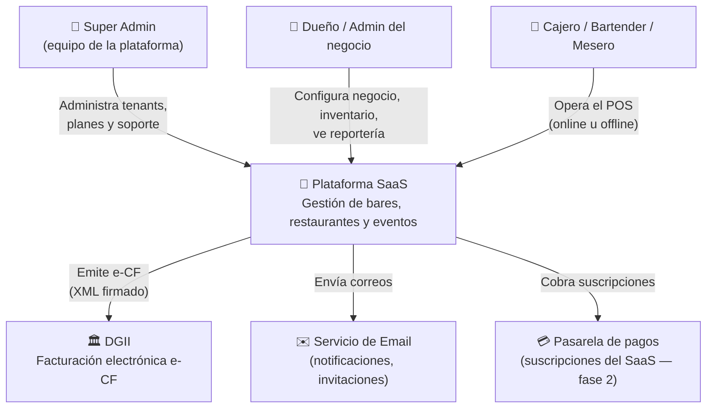
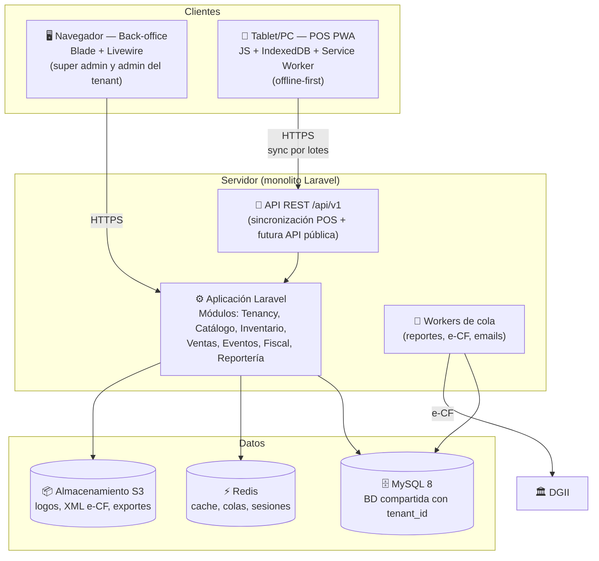
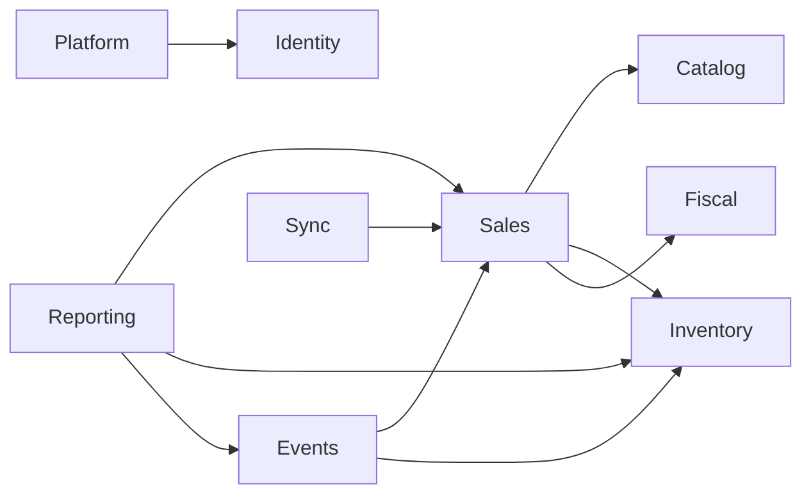

# 02 — Arquitectura del Sistema

## Nivel 1 — Diagrama de contexto (C4)

## Nivel 2 — Diagrama de contenedores (C4)

## Módulos del monolito

El monolito se organiza en módulos de dominio (carpetas `app/Domains/` o paquete
`nwidart/laravel-modules` — decidir al iniciar el código). Cada módulo expone
servicios; los controladores son delgados.

| Módulo | Responsabilidad |
|---|---|
| **Platform** | Tenants, planes, suscripciones, panel super admin |
| **Identity** | Usuarios, roles, permisos, invitaciones (spatie/laravel-permission) |
| **Tenancy** | Resolución del tenant, scoping global, contexto de unidad operativa |
| **Catalog** | Productos, categorías, precios, recetas (escandallo), modificadores |
| **Inventory** | Insumos, stock por unidad, compras, transferencias, mermas, conteos |
| **Sales** | Órdenes, pagos, sesiones de caja, mesas/zonas, turnos |
| **Events** | Eventos, puntos de venta, asignación de inventario, liquidación |
| **Fiscal** | Secuencias NCF, emisión e-CF, reportes DGII (606/607 export) |
| **Reporting** | Dashboards, reportes, cierre Z, consolidados de evento |
| **Sync** | Endpoint de sincronización del POS, resolución de idempotencia |

## Reglas de dependencia entre módulos

- **Catalog** e **Inventory** no conocen a **Sales** (dependencia en una sola dirección).
- **Fiscal** no conoce ningún dominio de negocio: recibe "documentos a foliar/emitir".
- **Reporting** solo lee (idealmente contra réplicas o tablas agregadas).

## Frontend: dos experiencias, un solo framework

| Experiencia | Tecnología | Por qué |
|---|---|---|
| Back-office (super admin, admin tenant, reportería, inventario) | **Blade + Livewire (TALL stack)** | Máxima productividad en Laravel puro; no necesita offline. |
| POS | **PWA (Vue 3 + IndexedDB + Service Worker)**, servida por el mismo Laravel | Offline-first es imposible con render de servidor. Ver [ADR-001](adr/ADR-001-stack-laravel.md) y [05 — POS Offline](05-pos-offline-sync.md). |

## Entornos

| Entorno | Propósito |
|---|---|
| `local` | Desarrollo (Laravel Sail / Herd) |
| `staging` | Pruebas de release, certificación e-CF con DGII (ambiente de pruebas) |
| `production` | Producción |
