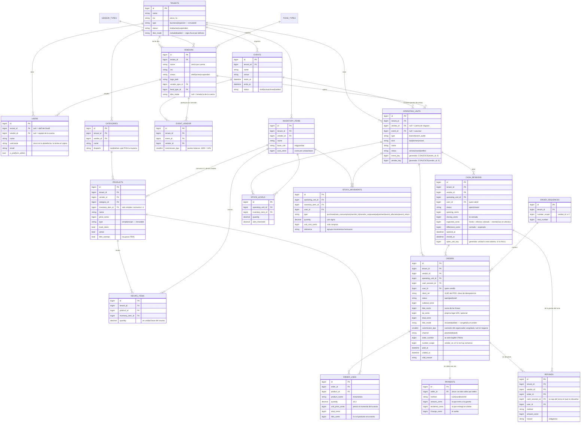

# 03 — Modelo de Datos (núcleo)

Convenciones:

- Todas las tablas de **negocio** llevan `tenant_id` (ver [ADR-002](adr/ADR-002-multi-tenancy.md)).
  Hay además tablas de **plataforma** que no lo llevan a propósito, porque son de todos:
  `role_templates`, `vendor_types`, `food_types` y `activity_log`.
- Dentro de una cuenta de organizador hay un segundo nivel de pertenencia: `vendor_id`,
  el comercio. Está en `categories`, `products`, `inventory_items`, `operating_units`,
  `users`, `orders`, `cash_sessions` y `refunds`. Es nulo en el mundo negocio.
- Todo lo transaccional cuelga de una **unidad operativa** (`operating_units`), que
  puede ser una sucursal o un punto de venta de evento.
- **Todas las claves primarias son `BIGINT` autoincrementales**, también en ventas.
  La idempotencia del POS offline no vive en el PK: vive en `orders.client_ref`
  (ver [ADR-003](adr/ADR-003-pos-offline.md)).
- Dinero en enteros (centavos) `BIGINT`; moneda DOP por defecto.
- Todo se guarda en UTC (`app.timezone`). Los cortes de día de reportería usan
  `app.business_timezone` = `America/Santo_Domingo`.

## Diagrama entidad-relación

Fuera del diagrama, pero en el esquema: `role_templates` (plantillas de rol de
plataforma, con sus permisos en JSON), las tablas de spatie/permission —con
*teams* activado y `team_foreign_key = tenant_id`, así que los roles son por
cuenta—, `activity_log` (auditoría) y `personal_access_tokens` (los tokens de
Sanctum con los que entra el POS).

## Decisiones de modelado clave

1. **El tipo de cuenta separa los dos mundos.** `tenants.type` es `business` u
   `organizer`, es inmutable y no tiene default en la BD: nadie acuña una cuenta sin
   elegir mundo. Un negocio tiene sucursales; un organizador tiene eventos.

2. **Dentro de un organizador, `vendor_id` es la segunda frontera.** Los comercios de
   un festival son negocios terceros: cada uno con su catálogo, su inventario, su
   equipo y sus ventas. Por eso `vendor_id` baja a las tablas que un comercio maneja
   por su cuenta, y los únicos se recomponen con una columna generada
   `vendor_key = COALESCE(vendor_id, 0)` — sin ella, en MySQL dos NULL no colisionan y
   el índice no restringiría nada en el mundo negocio. Gracias a eso dos comercios del
   mismo evento pueden tener cada uno su «Mojito».

3. **`operating_units` unifica sucursal y punto de evento.** Ventas, stock y cajas
   siempre referencian una unidad; el mundo al que pertenece es un atributo, no una
   estructura distinta. `event_id NULL` ⇒ sucursal; `event_id` presente ⇒ punto de
   venta de ese evento. POS, inventario y reportería son el mismo código en los dos.

4. **Inventario de eventos = movimientos, no tablas nuevas.** Asignar inventario a un
   punto de evento es un `transfer_out` de la bodega + `event_allocation` en el punto.
   La devolución al cerrar es el movimiento inverso. La liquidación se calcula:
   asignado − vendido (según recetas) − mermas − devuelto = faltante.

5. **Consumo de inventario derivado de recetas, al cobrar.** `PayOrder` explota la
   receta de cada línea y genera `stock_movements` de tipo `sale_consumption`. Un
   producto `simple` con `track_stock` e `inventory_item_id` consume su ítem 1:1. El
   consumo se aplana por insumo y se aplica en orden de id, para que los locks del
   ledger se tomen siempre igual y no haya abrazo mortal. El stock puede quedar
   negativo a propósito: un POS no bloquea una venta por un conteo desfasado.

6. **La venta congela cinco cosas, no una.** `order_lines` copia `product_name`,
   `unit_price_cents` e `itbis_cents`; la orden copia `itbis_mode` y `commission_bps`.
   Cambiar el catálogo, la regla fiscal de la cuenta o la comisión pactada nunca
   reescribe una venta ya hecha.

7. **El ITBIS se calcula línea a línea, y la modalidad es del negocio.**
   `products.itbis_exempt` dice si el producto grava; `itbis_mode` dice cómo se
   relaciona el precio de carta con el impuesto. Con `included` (lo normal en los bares
   de RD) el desglose se extrae hacia adentro, ×18/118, y el total no crece; con
   `added` el precio es la base y el 18 % se suma al cobrar. La regla vive en tres
   niveles y se resuelve de abajo arriba: `vendors.itbis_mode` si el comercio la
   declaró, si no `tenants.itbis_mode`, y a falta de todo, `included`. La propina legal
   del 10 % siempre se calcula sobre la base sin impuesto.

8. **`client_ref` es la idempotencia; el PK es un BIGINT como todos.** El POS genera un
   UUID por venta y lo manda en `client_ref`; el único
   `(tenant_id, operating_unit_id, client_ref)` hace que reenviar mil veces la misma
   orden produzca una sola. Se acota a la **unidad** porque dos dispositivos distintos
   no deben poder chocar entre sí. Y el reenvío se verifica: si llega la misma
   referencia con otras líneas u otra sesión, es un error operable, no un éxito
   silencioso sobre una venta ajena.

9. **El número de orden es lo que el cliente dicta: `P0041`.** La letra viene del canal
   (`pos`/`mobile`/`web`) y **no numera**: la serie es una sola por comercio, tomada de
   `order_sequences` dentro de la transacción de la venta, así que un rollback devuelve
   el número y no quedan huecos. `number_scope` es `vendor_id` o `0` —otra vez, porque
   dos NULL no colisionan en MySQL— y el único
   `(tenant_id, number_scope, order_number)` es el backstop de que dos ventas jamás
   compartan número. En MySQL el contador se toma en **un solo statement**
   (`INSERT ... ON DUPLICATE KEY UPDATE next_number = LAST_INSERT_ID(next_number) + 1`):
   la versión ingenua con `SELECT ... FOR UPDATE` provocaba deadlocks reales en la
   primera venta de cada serie, por gap locks del índice.

10. **La venta cobrada o anulada es historia, y el esquema lo sostiene.** `Order`,
    `OrderLine`, `Payment`, `Refund` y `CashSession` bloquean `updating` y `deleting`
    en el modelo; `SalesHistoryBuilder` bloquea además los updates y deletes masivos,
    que los eventos de Eloquent nunca verían, y para la escritura acotada a una clave
    (la forma que tiene el `save`) pregunta al modelo si esa fila concreta admite
    cambios. Los backstops están en la BD: `payments_one_per_order` (un doble cobro que
    escape al lock revienta y revierte el stock) y `cash_sessions_one_open_per_unit`
    sobre columna generada (una sola caja abierta por unidad).

11. **Devolver dinero es un asiento nuevo, no una edición.** `refunds` referencia la
    venta sin tocarla — como manda la contabilidad y como exigirá la DGII, donde esto
    será una nota de crédito B04. Dos detalles que no son obvios: el dinero sale de la
    caja **abierta** de quien devuelve (la de la venta original suele estar cerrada), y
    se devuelve por el mismo método por el que se cobró, sin pasarse de lo que entró
    por él. El inventario no se repone: lo que salió de la barra ya se sirvió.

12. **El arqueo cuadra con la gaveta.** Al cerrar,
    `expected_cents = opening_cents + efectivo cobrado en la sesión − reembolsos en
    efectivo cargados a esa sesión` y `difference_cents = contado − esperado`. Tarjeta
    y transferencia no viven en la gaveta, así que no cuentan. Con órdenes abiertas no
    se cierra: se cobran o se anulan.

13. **La hora que reporta es `paid_at`, en hora de RD.** Todo se guarda en UTC, pero los
    cortes de día se hacen con `app.business_timezone` (`America/Santo_Domingo`): un
    cierre a las 2 de la mañana pertenece al día de trabajo que le corresponde, no al
    siguiente. El índice `(tenant_id, status, paid_at)` es el que sostiene los
    agregados del dashboard.

14. **Los cambios de precio quedan registrados.** `Product` audita en `activity_log`
    (log `catalogo`) `name`, `price_cents`, `active`, `itbis_exempt`, `category_id` e
    `inventory_item_id`: quién, cuándo y desde qué valor.

15. **La memoria local del POS es parte del modelo.** El dispositivo guarda en IndexedDB
    (Dexie, base `eventbarrest-pos`) una bandeja de salida `outbox`
    (`++id, client_ref, status, created_at`) y un `kv` con el catálogo y la sesión. De
    ahí sale el `client_ref` que hace idempotente todo lo demás.

## Lo que todavía no existe

El bloque fiscal completo —`ncf_sequences`, `ncf_blocks`, `fiscal_documents`— está
diseñado pero **no migrado**. Lo mismo `pos_devices`: hoy el terminal se autentica como
**usuario** con un token de Sanctum (`POST /api/pos/login`), no como dispositivo. Los
permisos `fiscal.manage` y `pos_devices.manage` ya están reservados en el enum, pero no
tienen tabla detrás. Tampoco hay tabla `plans`: la suscripción todavía no se modela.
