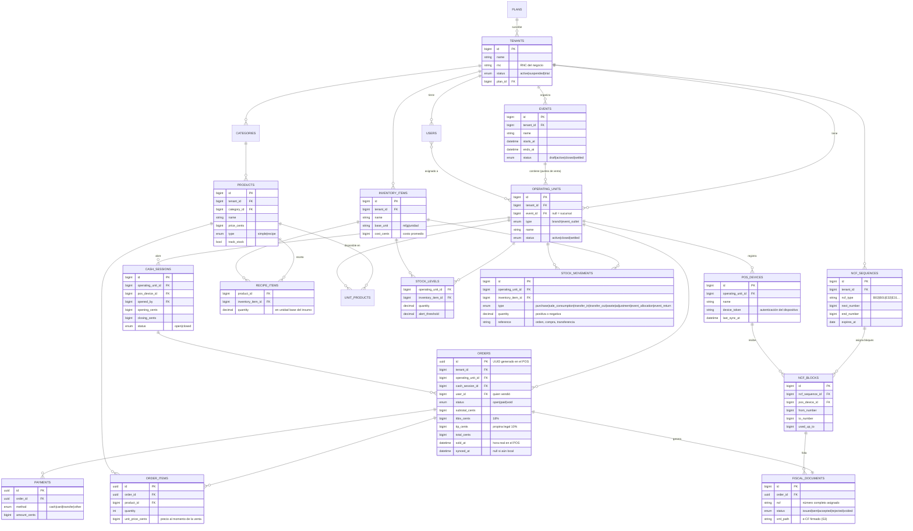

# 03 — Modelo de Datos (núcleo)

Convenciones:

- Todas las tablas de negocio llevan `tenant_id` (ver [ADR-002](adr/ADR-002-multi-tenancy.md)).
- Todo lo transaccional cuelga de una **unidad operativa** (`operating_units`), que
  puede ser una sucursal o un punto de venta de evento.
- Las órdenes y pagos usan **UUID generado en el cliente** para idempotencia en la
  sincronización offline (ver [ADR-003](adr/ADR-003-pos-offline.md)).
- Dinero en enteros (centavos) `BIGINT`; moneda DOP por defecto.

## Diagrama entidad-relación

## Decisiones de modelado clave

1. **`OPERATING_UNITS` unifica sucursal y punto de evento.** Ventas, stock, cajas y
   dispositivos siempre referencian una unidad operativa; la modalidad es un atributo,
   no una estructura distinta. `event_id NULL` ⇒ sucursal.

2. **Inventario de eventos = movimientos, no tablas nuevas.** Asignar inventario a un
   punto de evento es un `transfer_out` de la bodega principal + `event_allocation` en
   el punto. La devolución al cerrar es el movimiento inverso. La liquidación del
   evento se calcula: asignado − vendido (según recetas) − mermas − devuelto = faltante.

3. **Consumo de inventario derivado de recetas.** Al pagar una orden, cada
   `ORDER_ITEM` explota su receta y genera `STOCK_MOVEMENTS` tipo `sale_consumption`.
   Un producto `simple` con `track_stock` consume su propio ítem 1:1.

4. **Precio congelado en la venta.** `ORDER_ITEMS.unit_price_cents` copia el precio
   vigente; cambiar el catálogo nunca altera ventas históricas.

5. **UUIDs en órdenes/pagos, IDs autoincrementales en todo lo demás.** Solo lo que
   nace offline necesita UUID. El resto usa `BIGINT` por rendimiento de índices.

6. **`sold_at` ≠ `created_at`.** La hora fiscal y de reportería es la hora en que se
   vendió en el POS, no la hora en que llegó al servidor.
