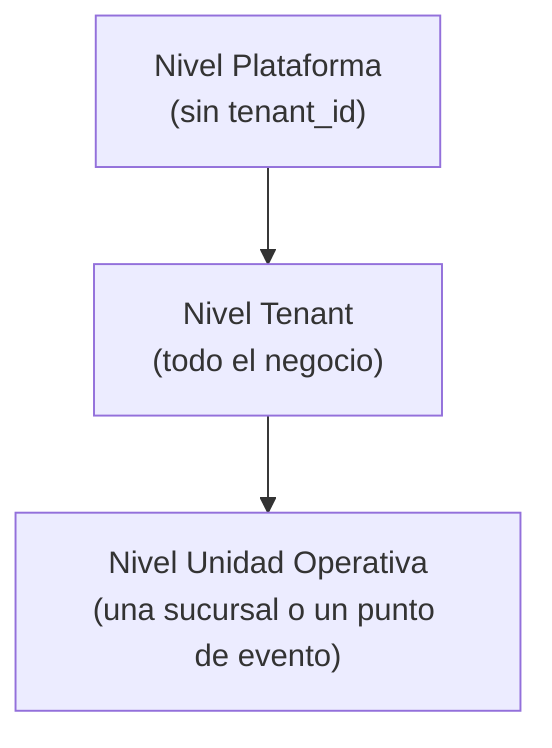

# 04 — Roles y Permisos

Implementación prevista: `spatie/laravel-permission` con **teams habilitado**
(el "team" es el tenant). Los usuarios de plataforma viven fuera del scoping de tenant.

## Jerarquía de contexto

Un usuario pertenece a **un tenant** y puede estar asignado a **una o varias unidades
operativas**. Los permisos de nivel unidad solo aplican dentro de las unidades asignadas.

## Roles predefinidos

| Rol | Nivel | Resumen |
|---|---|---|
| `super_admin` | Plataforma | Todo el panel de plataforma. |
| `platform_support` | Plataforma | Lectura de tenants para soporte; sin datos fiscales ni de dinero. |
| `owner` | Tenant | Todo dentro de su tenant. No eliminable, al menos uno por tenant. |
| `admin` | Tenant | Como owner menos: eliminar el negocio, gestionar facturación del SaaS. |
| `event_manager` | Tenant | Crear/gestionar eventos y sus puntos de venta. |
| `unit_manager` | Unidad | Gestiona su(s) unidad(es): inventario, personal, cierres, reportes de la unidad. |
| `warehouse` | Tenant/Unidad | Compras, recepciones, transferencias, conteos. Sin acceso a ventas. |
| `cashier` | Unidad | Opera el POS: órdenes, cobros, su propia caja. |
| `waiter` | Unidad | Toma órdenes y las envía; no cobra (fase 2, app de comandas). |

Los tenants pueden crear **roles personalizados** combinando permisos (fase 2);
el MVP arranca con los roles predefinidos.

## Matriz de permisos (extracto del MVP)

| Permiso | owner | admin | event_mgr | unit_mgr | warehouse | cashier |
|---|:-:|:-:|:-:|:-:|:-:|:-:|
| Gestionar usuarios del tenant | ✅ | ✅ | — | — | — | — |
| Configurar catálogo y precios | ✅ | ✅ | — | — | — | — |
| Crear eventos / puntos de venta | ✅ | ✅ | ✅ | — | — | — |
| Asignar inventario a evento | ✅ | ✅ | ✅ | — | ✅ | — |
| Liquidar/cerrar evento | ✅ | ✅ | ✅ | — | — | — |
| Compras y recepción de inventario | ✅ | ✅ | — | ✅ | ✅ | — |
| Transferencias entre unidades | ✅ | ✅ | — | ✅ | ✅ | — |
| Ajustes y mermas | ✅ | ✅ | — | ✅ | ✅ | — |
| Ver reportería del tenant completo | ✅ | ✅ | — | — | — | — |
| Ver reportería de su unidad | ✅ | ✅ | ✅ | ✅ | — | — |
| Abrir/cerrar caja propia | ✅ | ✅ | — | ✅ | — | ✅ |
| Vender en POS | ✅ | ✅ | — | ✅ | — | ✅ |
| Anular orden pagada | ✅ | ✅ | — | ✅ | — | — |
| Aplicar descuentos sobre límite | ✅ | ✅ | — | ✅ | — | — |
| Configurar secuencias NCF | ✅ | ✅ | — | — | — | — |
| Registrar dispositivos POS | ✅ | ✅ | — | ✅ | — | — |

## Reglas transversales

1. **Scoping absoluto por tenant**: ninguna consulta cruza tenants; se garantiza con
   global scopes + tests automáticos (ver [ADR-002](adr/ADR-002-multi-tenancy.md)).
2. **Acciones sensibles con re-autenticación o PIN de supervisor** en el POS:
   anulaciones, descuentos altos, apertura de gaveta sin venta.
3. **Auditoría**: toda acción de escritura relevante registra `who/what/when`
   (tabla `activity_log`, spatie/laravel-activitylog).
4. **El token de dispositivo POS no es un usuario**: autentica al *dispositivo*;
   el operador inicia sesión con PIN sobre ese dispositivo. Ambos quedan en la venta.
