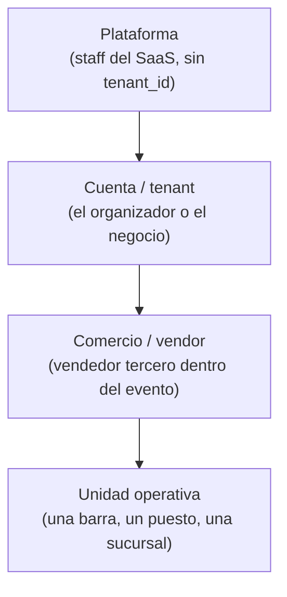

# 04 — Roles y Permisos

> **Estado (2026-08-05).** Esto ya no es un plan: está construido y con tests.
> Lo que sigue pendiente está marcado como tal al final.

Implementado con `spatie/laravel-permission` con **teams habilitado**: el "team" es
la cuenta (`config/permission.php` → `'teams' => true`, `'team_foreign_key' => 'tenant_id'`).
Cada cuenta tiene su propio juego de filas de roles y nunca comparte asignaciones
con otra.

Dónde vive:

| Pieza | Archivo |
|---|---|
| Catálogo de permisos | `app/Domains/Identity/Enums/Permission.php` |
| Roles de sistema | `app/Domains/Identity/Enums/Role.php` |
| Frontera cuenta/comercio | `app/Domains/Identity/Enums/RoleKind.php` |
| Plantillas de rol (BD) | `app/Domains/Identity/Models/RoleTemplate.php` |
| Alta y cambio de rol | `app/Domains/Identity/Actions/{CreateTenantUser,AssignTenantRole}.php` |
| Techo de concesión | `app/Domains/Identity/Actions/GrantCeiling.php` |
| Aprovisionamiento | `app/Domains/Identity/Actions/{ProvisionTenantRoles,ApplyRoleTemplates}.php` |
| Permisos efectivos | `app/Domains/Identity/Queries/UserPermissions.php` |
| La puerta de cada quien | `app/Domains/Identity/Queries/HomeForUser.php` |

## Jerarquía de contexto

Un usuario pertenece a **una cuenta** y, si es personal de comercio, a **un
comercio** (`users.vendor_id`). Esa pertenencia se fija siempre por código
(`CreateTenantUser`), nunca por mass assignment, y un guard del modelo `User`
exige que el comercio sea de la MISMA cuenta.

**No existe todavía asignación de usuarios a unidades operativas.** El acotado
real es el comercio: quien puede vender puede abrir caja en cualquier unidad
activa de su comercio, y `VendorScope` hace que lo de otro comercio simplemente
no exista en las consultas.

**El staff de la plataforma no es un rol**: es la bandera `users.is_platform_admin`.
No tiene `tenant_id`, así que `UserPermissions` le devuelve cero permisos de
negocio; lo único que le abre `/saas-admin` es esa bandera.

## Los permisos son fijos; los roles no

El catálogo de permisos vive en código y solo cambia con un despliegue: **un
permiso que ningún código comprueba no protege nada**. Lo que se compone
libremente son los **roles**.

| Permiso | Qué habilita | ¿Comprobado hoy? |
|---|---|:-:|
| `users.manage` | Crear usuarios y asignar roles | ✅ |
| `catalog.manage` | Categorías, productos, recetas e insumos | ✅ |
| `branches.manage` | Sucursales del negocio | ✅ |
| `event_outlets.manage` | Puestos de venta dentro de un evento | ✅ |
| `vendors.manage` | Alta y gestión de los comercios del organizador | ✅ |
| `events.manage` | Crear y administrar eventos | ✅ |
| `events.settle` | Cierre y liquidación financiera de un evento | reservado |
| `inventory.manage` | Existencias y compras | ✅ |
| `inventory.transfer` | Mover stock entre unidades del mismo comercio | ✅ |
| `inventory.adjust` | Conteos físicos y mermas | ✅ |
| `inventory.allocate_to_event` | Aprovisionar un evento desde el almacén | reservado |
| `sales.operate` | Operar el punto de venta | ✅ |
| `sales.void` | Anular una orden **antes** de cobrarla | reservado |
| `sales.refund` | Devolver dinero de una venta ya cobrada | ✅ |
| `sales.discount` | Aplicar descuentos | reservado |
| `cash_session.manage` | Apertura y cierre de caja | ✅ |
| `pos_devices.manage` | Dispositivos del punto de venta | reservado |
| `reports.view_tenant` | Reportería de toda la cuenta | ✅ |
| `reports.view_unit` | Reportería de su comercio o puesto | ✅ |
| `fiscal.manage` | NCF y configuración fiscal | reservado |

*Reservado* = el permiso existe y se puede marcar en un rol, pero todavía no hay
funcionalidad que lo compruebe. Está ahí para que los roles nazcan completos y no
haya que re-sembrar cuando llegue la función.

**Ocho de ellos son de administración de cuenta** (`Permission::accountOnly()`):
`users.manage`, `branches.manage`, `event_outlets.manage`, `vendors.manage`,
`events.manage`, `events.settle`, `reports.view_tenant`, `fiscal.manage`. Jamás
llegan al personal de un comercio, ni siquiera a través de un rol inventado por
el superadmin.

**Cinco son trabajo puro de caja** (`Permission::posOnly()`): `sales.operate`,
`sales.void`, `sales.refund`, `sales.discount`, `cash_session.manage`. Quien solo
tiene de estos no encuentra una sola pantalla en el panel — y por eso no se le
deja entrar.

## Roles de sistema

Siete, con estos permisos por defecto:

| Rol | Se asigna a | Permisos |
|---|---|---|
| `owner` — Dueño | Cuenta | **Todos**. Siempre debe existir al menos uno. |
| `admin` — Administrador | Cuenta | **Todos** (mismos que el dueño; la diferencia son los guards, no los permisos). |
| `event_manager` — Gerente de eventos | Cuenta | `events.manage`, `events.settle`, `event_outlets.manage`, `inventory.allocate_to_event`, `reports.view_unit` |
| `vendor_manager` — Encargado de comercio | Comercio | `catalog.manage`, `inventory.*`, `reports.view_unit`, `sales.operate`, `sales.void`, `sales.refund`, `sales.discount`, `cash_session.manage`, `pos_devices.manage` |
| `unit_manager` — Gerente de unidad | Cuenta | Lo mismo que el encargado de comercio **menos** `catalog.manage` |
| `warehouse` — Almacén | Ambos | `inventory.manage`, `inventory.transfer`, `inventory.adjust`, `inventory.allocate_to_event` |
| `cashier` — Cajero | Ambos | `sales.operate`, `cash_session.manage` |

Dos consecuencias que conviene tener claras:

- **El cajero no devuelve dinero.** `sales.refund` no está en su plantilla: el POS
  ni siquiera le pinta el botón, y si lo llamara a mano la API responde 403.
- **`admin` no es un `owner` recortado.** Tienen los mismos permisos. Lo que
  protege al dueño es que su plantilla no se edita ni se elimina, y que no se
  puede degradar al último dueño de una cuenta.

## Los roles son plantillas editables

Los siete de arriba son solo el punto de partida. El sistema de roles vive en la
tabla `role_templates` y lo opera **el superadmin** desde `/saas-admin → Roles y
permisos`:

- Ajustar los permisos de cualquier rol de sistema (salvo el de dueño).
- Crear roles nuevos ("Supervisor de barra", "Auditor de evento"…) marcando
  permisos del catálogo.
- Decidir a quién se puede asignar cada uno: equipo de la cuenta, personal de
  comercio, o ambos.

Cada plantilla tiene `name` (identificador interno, derivado del nombre y ya
inmutable), `label`, `description`, `kind`, `is_system` y su lista de `permissions`.
Al guardar, `ApplyRoleTemplates` materializa el cambio como filas de spatie en
**todas** las cuentas, cada una en su propia transacción; el reintento es
idempotente. Para las cuentas dadas de alta antes de un rol nuevo existe además
`php artisan identity:provision-roles`.

Los guards que impiden romper el sistema desde esa pantalla:

- La plantilla de **dueño** ni se edita ni se elimina: es la raíz de cada cuenta.
- Las plantillas de **sistema** se ajustan, nunca se eliminan.
- `name`, `kind` e `is_system` son inmutables tras el alta: si el alcance cambiara,
  usuarios ya asignados quedarían del lado equivocado de la frontera.
- Un rol **sin permisos** o con un permiso **desconocido** se rechaza.
- Los identificadores del enum quedan **reservados** aunque la plataforma esté
  virgen (nadie puede crear un "Owner" propio y dejar a las cuentas sin dueño).
- Una plantilla **con usuarios asignados** no se elimina; al eliminar una libre,
  se retiran también sus filas de spatie en cada cuenta.
- Los roles huérfanos y **sin titulares** que queden en una cuenta se limpian solos
  en el siguiente aprovisionamiento; los que tienen titulares se conservan.

## Las dos reglas que sostienen todo esto

**1. Frontera cuenta/comercio.** Un rol de cuenta no baja a un comercio y un rol
de comercio no existe suelto en la cuenta. Se comprueba tres veces: al guardar la
plantilla (los permisos `accountOnly` ni se ofrecen para roles de comercio), al
crear el usuario y al cambiarle el rol después.

**2. Techo de concesión.** Nadie concede un rol cuyos permisos no sean subconjunto
de los suyos propios. Cierra la escalada clásica: quien solo tiene `users.manage`
no puede ascenderse —ni ascender a otro— a dueño. Se mide por **capacidad**, no por
nombre de rol, así que resiste igual de bien a los roles que invente el superadmin.
El staff de plataforma y los procesos sin actor (seeders, comandos, tests de
dominio) no tienen techo.

Además: **un usuario tiene exactamente un rol** (`syncRoles` con un solo nombre;
no se acumulan), y **no se puede degradar al último dueño** de una cuenta.

## Qué permiso abre cada puerta

| Puerta | Quién entra |
|---|---|
| `/entrar` | Todos. Acepta correo o nombre de usuario; 5 intentos por identidad+IP; un solo mensaje de error. Al entrar, `HomeForUser` manda a cada quien a lo suyo. |
| `/saas-admin` | Solo `is_platform_admin`. |
| `/app` (Filament heredado) | Cuenta no suspendida, comercio no suspendido y **no** ser alguien que solo opera el POS. El personal de comercio que caiga en su dashboard rebota a `/event-vendor`. |
| `/event-panel` | Equipo de la cuenta del organizador. Cada acción exige su permiso: `vendors.manage` para comercios, `events.manage` para eventos, `event_outlets.manage` para puestos, `users.manage` para dar de alta gente, `catalog.manage` e `inventory.manage` para tocar el comercio. El dashboard abre para todos pero **sin números** salvo con `reports.view_tenant`. |
| `/event-vendor` | Personal de un comercio con al menos un permiso de gestión (`catalog.manage`, `inventory.manage`, `inventory.transfer`, `inventory.adjust` o `reports.view_unit`). Entrada positiva, fail-closed: quien no los tenga rebota al POS si puede operarlo, y si no, 403. |
| `/pos` y `/event-pos` | Cáscara pública: la pantalla no autoriza nada. Todo se decide en la API. |

## El POS

El token **es del usuario**, no del dispositivo. `POST /api/pos/login` autentica con
`username` + `password`, comprueba `canOperateThePos()` (cuenta y comercio activos,
y tener `sales.operate` o `cash_session.manage`), verifica que la modalidad de la
app coincide con la de su cuenta, y emite un token Sanctum con la habilidad `pos`.
`device_name` es solo la etiqueta de ese token.

Cada petición pasa por `auth:sanctum` → `SetTenantContext` → `EnsurePosCapability`,
que revalida al portador **en cada llamada** (rol vigente, cuenta y comercio
activos, habilidad `pos`, y comercio presente si la cuenta es de organizador).
Después, cada endpoint pide lo suyo:

| Endpoint | Permiso |
|---|---|
| `GET /api/pos/bootstrap`, `GET /api/pos/catalog` | solo la puerta |
| `POST /api/pos/sessions`, `POST /api/pos/sessions/{id}/close` | `cash_session.manage` |
| `POST /api/pos/orders` | `sales.operate` |
| `GET /api/pos/sales` | solo la puerta (ventas de esa caja) |
| `POST /api/pos/sales/{order}/refund` | `sales.refund` |

`bootstrap` devuelve además la lista de permisos del usuario: la PWA la usa para no
ofrecer lo que el servidor va a rechazar (el botón de devolver solo aparece con
`sales.refund`). Es cortesía de interfaz, no seguridad: la decisión sigue estando
en el servidor.

Y **cambiar el rol revoca los dispositivos**: si el rol nuevo ya no vende ni maneja
caja, los tokens del usuario se borran en el acto.

## Reglas transversales

1. **Scoping absoluto por cuenta y por comercio**: ninguna consulta cruza cuentas
   (global scopes + tests), y dentro de una cuenta de organizador `VendorScope`
   hace que lo de otro comercio no exista (ver [ADR-002](adr/ADR-002-multi-tenancy.md)).
2. **Las suspensiones cortan por todas las puertas** con la misma regla: cuenta
   suspendida o comercio suspendido cierran panel, `/event-vendor` y POS. Un
   comercio "en alta" (borrador) sí opera.
3. **Las acciones sensibles se deciden por permiso**, no por PIN. Hoy no existe
   PIN de supervisor ni re-autenticación en el POS: devolver dinero exige
   `sales.refund` en el usuario del token, y punto.
4. **Auditoría**: `activity_log` (spatie/laravel-activitylog) está instalado y hoy
   registra cambios de **producto** —incluido el precio— y de **cuenta**. El resto
   de la trazabilidad del dinero no depende de logs: las órdenes y los pagos son
   inmutables, los reembolsos guardan quién los hizo y en qué caja, y los arqueos
   quedan cerrados.

## Pendiente

- Descuentos (`sales.discount`) y anulación desde el POS: `VoidOrder` existe en el
  dominio pero ninguna ruta lo expone todavía.
- Registro de dispositivos POS (`pos_devices.manage`).
- Liquidación de eventos (`events.settle`) y asignación de stock a evento
  (`inventory.allocate_to_event`).
- Módulo fiscal (`fiscal.manage`): secuencias NCF, foliado, notas de crédito.
- Asignación de usuarios a unidades operativas concretas.
- App de comandas (el rol `waiter` del borrador v0.1 no existe todavía).
- Permisos granulares para el staff de plataforma: hoy es una sola bandera, sin
  perfil de soporte de solo lectura.
- La puerta `/business` (modalidad negocio independiente) sigue sin construirse;
  su POS, `/pos`, sí existe.
