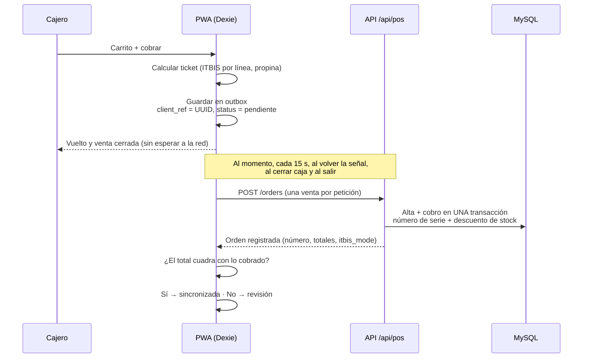
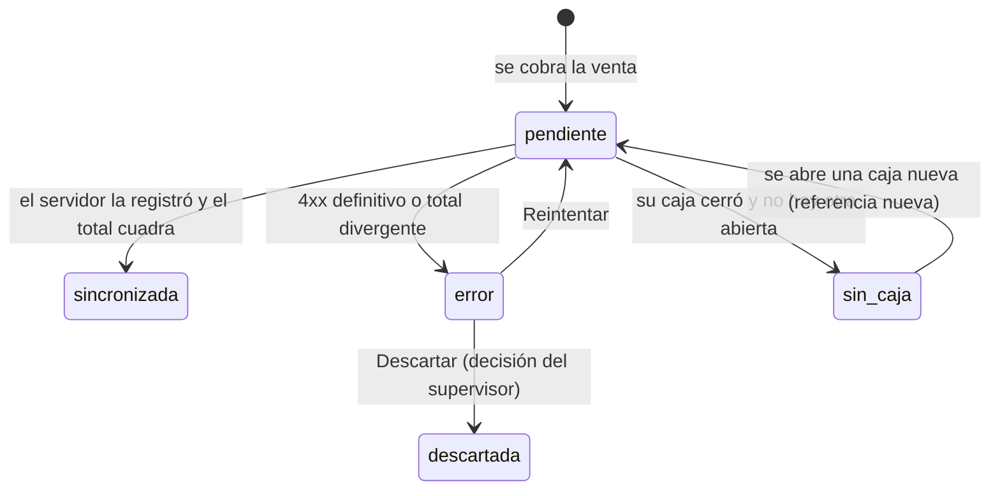

# 05 — POS Offline y Sincronización

Decisión de fondo en [ADR-003](adr/ADR-003-pos-offline.md): outbox local e idempotencia,
sin motor de sync genérico. La decisión sigue viva; los detalles de aquel ADR
(`/api/v1/sync/push`, lotes, upsert por UUID, `catalog_version`) quedaron atrás.
**Este documento describe lo que hay construido y corriendo.**

## Principios

1. **Vender no depende de la red.** El carrito, el cobro y la bandeja de salida viven
   en el dispositivo (IndexedDB vía Dexie). Lo demás —abrir caja, cerrar caja, ver las
   ventas del turno, reembolsar— sí exige señal, a propósito: son actos de
   administración, no de venta.
2. **El servidor es la fuente de verdad del catálogo, de la regla fiscal y del número
   de orden.** El dispositivo calcula el ticket espejando al servidor, pero el registro
   oficial lo escribe el servidor.
3. **Las ventas no compiten entre sí.** Cada venta nace con un `client_ref` (UUID)
   propio del dispositivo; dos terminales jamás tocan la misma orden.
4. **Reenviar es seguro.** El servidor registra la misma venta una sola vez, y si la
   referencia se reutiliza con OTRO contenido lo dice en vez de fingir éxito.
5. **Ningún descuadre pasa callado.** Si lo que se cobró no coincide con lo que el
   servidor registró, la venta va a revisión con nombre y apellido.

## Dos puertas, un solo motor

| Puerta | Modalidad | Manifiesto |
|---|---|---|
| `/pos` | `business` (negocios: bares, restaurantes) | `/pos-manifest.webmanifest` |
| `/event-pos` | `event` (puestos de un evento) | `/event-pos-manifest.webmanifest` |

Mismo cascarón Blade, mismo bundle, mismo service worker: cambian el título, el icono,
el `start_url` y el `data-modalidad` del contenedor. Cada una se instala como su propia
app y el cajero solo ve la suya. El login envía esa modalidad y el servidor rechaza al
cajero del mundo equivocado con un mensaje que le dice a qué app ir —no con un
«credenciales incorrectas» que lo deje pensando que falló su clave.

La pieza más delicada del sistema (el motor offline) no se mantiene por duplicado.

## Qué vive en el dispositivo

Dexie, base `eventbarrest-pos`, dos tablas:

| Tabla | Contenido |
|---|---|
| `outbox` | Una fila por venta cobrada, con su estado, su `client_ref`, lo que se le mostró al cliente (`display`) y, cuando sincroniza, la respuesta del servidor |
| `kv` | `device` (nombre autogenerado del equipo), `user`, `cache` (unidades + catálogo + caja), `draft` (el carrito a medias) y `my_session_id` |

Lo que **no** vive en el dispositivo: stock (se descuenta en el servidor al cobrar,
explotando recetas), numeración fiscal y cualquier dato de otro comercio.

El borrador del carrito sobrevive a una recarga o a que cierren la app: al volver, el
cajero encuentra su venta a medias donde la dejó.

## La API del POS

Token de Sanctum con habilidad `pos`, emitido por el login del propio POS.

| Endpoint | Para qué |
|---|---|
| `POST /api/pos/login` | Usuario + clave + nombre del dispositivo + modalidad. 5 intentos por minuto. |
| `GET /api/pos/bootstrap` | Quién soy, mis permisos, mis unidades y las cajas abiertas |
| `GET /api/pos/catalog` | Catálogo completo vendible + `settings.itbis_mode` |
| `POST /api/pos/sessions` | Abrir caja (fondo inicial) |
| `POST /api/pos/sessions/{id}/close` | Cerrar caja contra lo contado |
| `POST /api/pos/orders` | **Sincronizar una venta.** Idempotente por `client_ref` |
| `GET /api/pos/sales` | Las ventas de ESTA caja |
| `POST /api/pos/sales/{order}/refund` | Devolver dinero (permiso `sales.refund`) |
| `POST /api/pos/logout` | Mata el token del dispositivo |

Cada petición vuelve a autorizar de cero (`EnsurePosCapability`): rol vigente, cuenta y
comercio activos, token con habilidad `pos`. En una cuenta de organizador el POS opera
siempre para un comercio: el equipo del organizador mira desde el panel, no vende.

Todo error operable llega como `{ code, message }` con 422. **La app decide por código,
nunca parseando mensajes.**

## El ciclo de una venta

La venta viaja **ya cobrada**: el servidor la da de alta y la cobra en la misma
transacción. Si el cobro falla, la orden no queda abierta bloqueando el cierre de caja;
el reintento parte de cero.

## Idempotencia: qué garantiza exactamente

`PlaceOrder` busca la venta por `(unidad operativa, client_ref)` **antes** de crear nada:

- **Ya existe y es la misma venta** (misma caja, mismas líneas, misma propina): se
  devuelve tal cual, con 200. Cero órdenes duplicadas, cero cobros duplicados, cero
  descuentos de stock duplicados.
- **Ya existe pero el contenido difiere**: 422 `client_ref_reused`. Es un error operable
  —el dispositivo debe renumerar— y no un éxito silencioso sobre otra venta.
- **Ya existe y está anulada**: 409 `order_voided`. Una anulada no se re-cobra con la
  misma referencia.
- **No existe**: se crea, se cobra, se numera y se descuenta el stock.

El lookup va **antes** del guard de sesión a propósito: un reenvío que llega tarde,
cuando la caja ya cerró, recibe la venta registrada en vez de un error.

## El número que el cliente dicta

El UUID es cosa interna. Lo que el cajero lee y el cliente recuerda es `P0041`: la letra
del canal (POS) más un correlativo de **serie por comercio** (por cuenta si no hay
comercio), tomado del contador `order_sequences` dentro de la transacción de la venta —
así un rollback devuelve el número y la serie no deja huecos. Importa: algún día esta
numeración será fiscal.

## La bandeja: estados y reglas

Nada se borra: las filas cambian de estado y quedan como historia local del dispositivo.

Una sola corrida de sincronización en vuelo: el intervalo de 15 s, la vuelta de la señal,
el cobro recién hecho y el cierre de caja comparten la misma. Dentro de la corrida, cada
fallo se clasifica:

| Situación | Qué hace el POS |
|---|---|
| Sin red (`fetch` falla) | Corta el bucle entero: lo demás puede esperar |
| 401 / 403 | Devuelve al login: el token murió o el rol cambió |
| 429 o 5xx | Transitorio: sigue `pendiente`, reintenta en la próxima corrida |
| `session_not_open` con otra caja abierta | Reasigna la venta a la caja abierta **con `client_ref` nuevo** (el viejo pertenece a la sesión anterior) |
| `session_not_open` sin caja abierta | Queda `sin_caja`; renace `pendiente` al abrir la siguiente caja |
| Cualquier otro 4xx (`product_not_sellable`, `client_ref_reused`, `order_voided`…) | Definitivo: a revisión con su código y su mensaje |
| El total del servidor ≠ lo cobrado al cliente | A revisión con `total_divergente`; el POS adopta el `itbis_mode` del servidor |

### El cierre del lazo por total divergente

Es la defensa contra un dispositivo que quedó con la regla fiscal vieja. El POS compara
lo que le cobró al cliente con el `total_cents` que devolvió el servidor. Si no coinciden,
esa venta **no** se marca como buena: va a revisión con un mensaje en pesos («se cobró
X y el sistema registró Y: revisa con tu encargado») y el dispositivo adopta desde ya la
modalidad de ITBIS que informó el servidor. Un faltante en la caja tiene nombre y venta,
no aparece como un descuadre anónimo al arquear.

### La pantalla de la bandeja

En la barra hay dos chips: «N por sincronizar» (pendientes y sin caja) y «N en revisión».
Cualquiera de los dos abre la bandeja, donde aparecen las filas abiertas **y las 10
últimas sincronizadas** —ahí es donde el cajero encuentra el número `P0041` para
dictárselo al cliente; sin eso, la bandeja solo hablaría en UUID. Cada fila trae
Reintentar, y las que están en revisión también Descartar.

## Caja: apertura, cierre y el arqueo

- **Abrir caja exige red.** Es la única llamada online garantizada del turno, así que se
  aprovecha para revalidar el catálogo y con él la regla fiscal: cobrar con la vieja sería
  cobrar de menos.
- **Al abrir, las ventas huérfanas renacen**: todo lo que quedó `sin_caja` pasa a
  `pendiente` en la caja nueva, con referencia nueva.
- **Cerrar exige la bandeja vacía.** El POS sincroniza primero y se niega a cerrar si
  queda algo pendiente o en revisión, con el motivo concreto. Mientras se cierra no se
  puede cobrar.
- **El servidor tiene su propio guard**: no se cierra una caja con órdenes abiertas
  (`session_has_open_orders`). Lo esperado en gaveta es fondo inicial + efectivo cobrado −
  efectivo devuelto; tarjeta y transferencia no viven en la gaveta.
- **Salir del POS también exige la bandeja vacía**: nadie deja ventas cobradas
  encerradas en un equipo del que ya salió.

## El ticket, calculado dos veces

El dispositivo calcula el ticket espejando exactamente al servidor, para que el cliente
vea lo mismo que quedará registrado:

- ITBIS **por línea**, con redondeo por línea. Un producto exento (`itbis_exempt`) no
  aporta. Un catálogo cacheado sin el flag cuenta como gravado, igual que el default del
  servidor.
- Según la modalidad del negocio: **incluido** (se extrae, ×18/118, el total no crece) o
  **por fuera** (se suma al cobrar).
- **Propina legal del 10 %**, opcional, siempre sobre la base sin impuesto.
- Tarjeta y transferencia se cobran por el monto exacto: el vuelto solo existe en efectivo.

Manda el servidor. El cálculo local es para que el cajero pueda cobrar sin red, no para
tener la última palabra —de ahí el control de total divergente.

## Ventas del turno y reembolsos

El listado es de **la caja**, no del comercio entero: es lo que el cajero necesita para
buscar «la venta de hace un rato». Se lee del servidor, así que exige señal, igual que el
reembolso —una devolución de dinero es un acto supervisado, con motivo obligatorio y bajo
el permiso propio `sales.refund`, que no todo cajero tiene. El botón solo aparece si el
permiso llegó en el bootstrap.

## El cascarón offline (service worker)

Al instalar se precachea el cascarón y **todos los assets con hash** leídos del
`manifest.json` de Vite. El install es todo-o-nada: si la red cae a mitad, falla y el
service worker anterior sigue sirviendo su shell —jamás se activa un cascarón vacío
encima de uno que funcionaba.

- Navegación: red primero, cache de respaldo.
- Assets de `/build/`, manifiesto e icono: cache primero.
- **`/api/` nunca se cachea.** Los datos viven en Dexie y en la API, no aquí.

> Límite conocido: hoy el precache cubre el cascarón de `/pos`. `/event-pos` comparte
> los assets pero no tiene su propia entrada de navegación cacheada.

## Límites explícitos de hoy

- **No hay mesas ni cuentas abiertas en el POS**: la venta nace y se cobra en el mismo
  gesto. El carrito a medias vive en el `draft` de ese dispositivo y no se comparte entre
  terminales.
- **Abrir y cerrar caja, listar ventas y reembolsar exigen red.** Vender, no.
- **No hay enrolamiento de dispositivos ni revocación de tokens desde el back-office.**
  El cajero entra con usuario y clave; el nombre del equipo solo etiqueta el token. Hoy
  el token se mata desde el propio dispositivo al salir.
- **No hay NCF.** El foliado fiscal está pendiente (ver doc 06): lo que existe es la
  numeración legible por comercio.
- **La reportería en tiempo real refleja solo lo sincronizado.** El cierre de evento
  —con verificación de terminales pendientes— todavía no está construido; lo que hay es
  que ningún terminal puede cerrar su caja con la bandeja sucia.
- **El stock puede quedar negativo** y es a propósito: un POS jamás bloquea una venta ya
  cobrada. El conteo físico manda.
