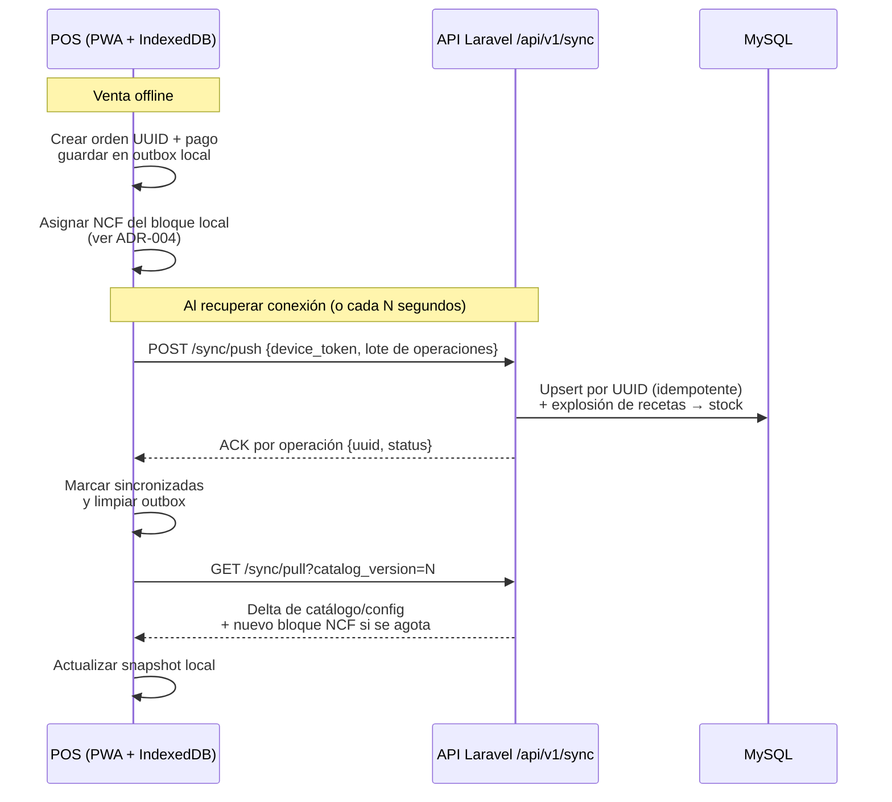
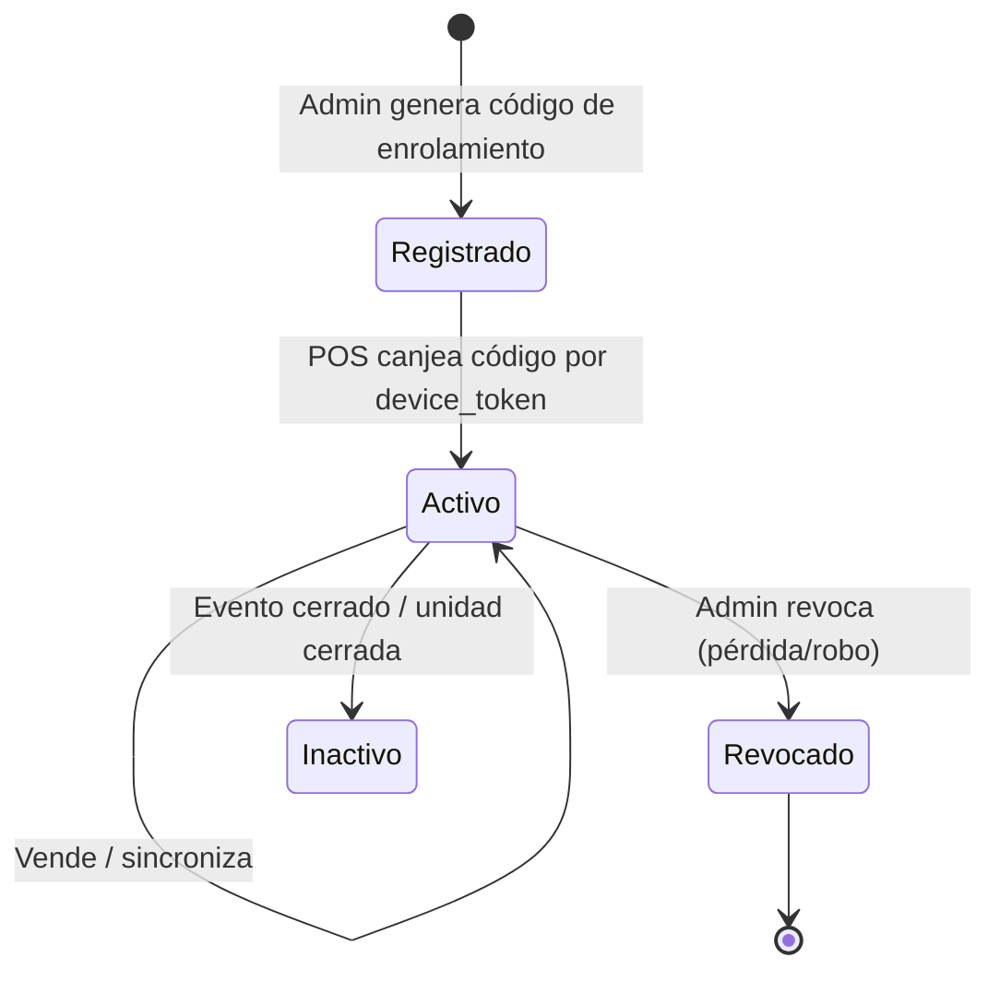

# 05 — POS Offline y Sincronización

Decisión de fondo en [ADR-003](adr/ADR-003-pos-offline.md). Este documento describe el
funcionamiento.

## Principios

1. **El POS siempre opera contra su base local** (IndexedDB). La red es una mejora,
   nunca un requisito para vender.
2. **El servidor es la fuente de verdad del catálogo y la configuración**;
   **el POS es la fuente de verdad de sus propias ventas** hasta que sincroniza.
3. **Las ventas nunca generan conflictos**: cada terminal crea órdenes con UUID propio;
   dos terminales jamás editan la misma orden.
4. **Sincronización idempotente**: reenviar el mismo lote no duplica nada
   (upsert por UUID).

## Qué vive en el dispositivo

| Datos | Dirección | Notas |
|---|---|---|
| Catálogo (productos, precios, categorías, impuestos) | Servidor → POS | Snapshot versionado; se refresca al abrir sesión y por pull periódico |
| Configuración de unidad (mesas, métodos de pago, bloque NCF) | Servidor → POS | |
| Órdenes, ítems, pagos | POS → Servidor | Cola de salida local (outbox) |
| Sesión de caja (apertura, movimientos, cierre) | POS → Servidor | |
| Stock local aproximado | Servidor → POS (base) + descuenta local | Solo indicativo para alertas; el stock real se consolida en el servidor |

## Flujo de sincronización

## Reglas de resolución

| Situación | Regla |
|---|---|
| Catálogo cambió mientras el POS estaba offline | El POS vendió con el precio de su snapshot; la venta es válida (precio congelado). El nuevo precio aplica al refrescar. |
| Producto desactivado mientras offline | Las ventas ya hechas se aceptan; el producto desaparece al refrescar. |
| Stock quedó negativo al consolidar | Se acepta el movimiento y se marca alerta de descuadre; el conteo físico manda. Nunca se bloquea una venta ya cobrada. |
| Mismo lote reenviado (timeout, reintento) | Upsert por UUID: cero duplicados. |
| Reloj del dispositivo desviado | `sold_at` se registra tal cual + `synced_at` del servidor; descuadres grandes generan alerta al gerente. |
| Dispositivo perdido/robado | Revocar `device_token` desde el back-office; su bloque NCF sin usar se anula. |

## Ciclo de vida del dispositivo POS

## Límites explícitos del modo offline

- **No hay transferencia de órdenes entre terminales offline** (una mesa abierta vive
  en un solo terminal hasta sincronizar). Compartir mesas entre terminales requiere red.
- Reportería en tiempo real refleja solo lo sincronizado; el cierre del evento exige
  que todos los terminales hayan sincronizado (el sistema lo verifica y lista los
  pendientes).
- El enrolamiento inicial del dispositivo y la apertura de la primera sesión
  requieren conexión (para bajar snapshot y bloque NCF).
